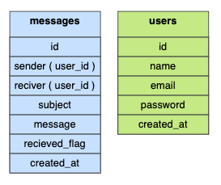

# Messenger API Documentation
Welcome to the Messenger API documentation. This API provides functionality for handling messages between users.

<!-- [Visit the Messenger API](https://messager-api-c2cd41880be6.herokuapp.com) -->

#### API Url : [https://messager-api-c2cd41880be6.herokuapp.com](https://messager-api-c2cd41880be6.herokuapp.com)

## Authentication
To access protected routes, include the following header in your request:
###### Authorization: Bearer <TOKEN>

### About Database
Include a comprehensive visual representation of the project's database structure by referring to the attached image showcasing the two main tables, along with their respective attributes. This illustration provides a clear overview of the relational schema and enhances understanding of the data model implemented in the Messenger API project.

# API Endpoints : 
## Auth - /auth/ 

### 1. Profile
##### Method: GET
#### Description: 
Retrieve the current user's profile information.
##### URL: 
/api/auth/profile
###### Headers:
    Accept: application/json
    Authorization: Bearer <TOKEN>

### 2. Logout
##### Method: GET
#### Description: 
    Logout the current user.
##### URL: 
    /api/auth/logout
###### Headers:
    Accept: application/json
    Authorization: Bearer <TOKEN>

### 3. Login
##### Method: POST
#### Description: 
    Authenticate a user and generate an access token.
##### URL: 
    /api/auth/login
###### Headers:
    Accept: application/json
##### Body: (json)
    {
        "email": "your_email@example.com",
        "password": "your_password"
    }
##### Validations: (Rules)
    {
        "email" => [
            "this field is required",
            "this string must be on email address structure",
            "this string length must be have maximum 255 charachters",
            "this string length must be have minimum 6 charachters",
        ],
        "password" => [
            "this field is required",
            "this field must be with type string",
            "this string length must be have maximum 50 charachters",
            "this string length must be have minimum 8 charachters",
            "must contain at least one letter",
        ]
    }

### 4. Register
##### Method: POST
#### Description: 
Create a new user account.
##### URL: 
/api/auth/register
###### Headers:
    Accept: application/json
##### Body: (json)
    {
        "name": "Your Name",
        "email": "your_email@example.com",
        "password": "your_password",
        "password_confirmation": "your_password"
    }
##### Validations: (Rules)
    {
        "name" => [
            "this field is required",
            "this field must be with type string",
            "this string length must be have maximum 255 charachters",
            "this string length must be have minimum 2 charachters",
        ],
        "email" => [
            "this field is required",
            "this string must be on email address structure",
            "this field must be with uniqe value",
            "this string length must be have maximum 255 charachters",
            "this string length must be have minimum 6 charachters",
        ],
        "password" => [
            "this field is required",
            "this field must be with type string",
            "this string length must be have maximum 50 charachters",
            "this string length must be have minimum 8 charachters",
            "must contain at least one letter",
            "this form fields must contain field with name : \n password_confirmation with the same content of this field"
        ]
    }

## Message - /msg/

### 1. Write Message
##### Method: POST
#### Description: 
Send a new message to another user.
##### URL: 
/api/msg/send_message
###### Headers:
    Accept: application/json
    Authorization: Bearer <TOKEN>
##### Body: (json)
    {
        "reciver": 2,
        "message": "Your Message",
        "subject": "Message Subject"
    }
##### Validations: (Rules)
    {
        "reciver" => [
            "this field is required",
            "this field must be with type integer(number)",
            "this field value must be gretter then 1",
        ],
        "message" => [
            "this field is required",
            "this field must be with type string",
            "this string length must be have maximum 255 charachters",
            "this string length must be have minimum 3 charachters",
        ],
        "subject" => [
            "this field is required",
            "this field must be with type string",
            "this string length must be have maximum 255 charachters",
            "this string length must be have minimum 3 charachters",
        ]
    }

### 2. Delete Message
##### Method: POST
#### Description: 
Delete a specific message.
##### URL: 
/api/msg/delete_message
###### Headers:
    Accept: application/json
    Authorization: Bearer <TOKEN>
##### Body: (json)
    {
        "message_id": 1
    }
##### Validations: (Rules)
    {
        "message_id" => [
            "this field is required",
            "this field must be with type integer(number)",
            "this field value must be gretter then 1",
        ],
    }

### 3. Get Chat With
##### Method: GET
#### Description: 
Fetch all messages exchanged with a particular user.
##### URL: 
/api/msg/get_chat_with
#### * this method allows pagination (for implement : add "page" on body)
###### Headers:
    Accept: application/json
    Authorization: Bearer <TOKEN>
##### Body: (json)
    {
        "user_id": 1
        // Optional: "page": 2
    }
##### Validations: (Rules)
    {
        "user_id" => [
            "this field is required",
            "this field must be with type integer(number)",
            "this field value must be gretter then 1",
        ],
    }

### 4. Get Unread Messages From
##### Method: GET
#### Description: 
Retrieve all unread messages sent by a specific user.
##### URL: 
/api/msg/get_unread_messages_from
#### * this method allows pagination (for implement : add "page" on body)
###### Headers:
    Accept: application/json
    Authorization: Bearer <TOKEN>
##### Body: (json)
    {
        "user_id": 4
        // Optional: "page": 2
    }
##### Validations: (Rules)
    {
        "user_id" => [
            "this field is required",
            "this field must be with type integer(number)",
            "this field value must be gretter then 1",
        ],
    }
    
### 5. Mark Message As Read
##### Method: POST
#### Description: 
Mark a message as unread.
##### URL: 
/api/msg/update_message_as_read
###### Headers:
    Authorization: Bearer <TOKEN>
##### Body: (json)
    {
        "message_id": 4
    }
    Validations: (Rules)
    {
        "message_id" => [
            "this field is required",
            "this field must be with type integer(number)",
            "this field value must be gretter then 1",
        ],
    }

### 6. Get Last Conversations
##### Method: GET
#### Description: 
Retrieve the latest conversations with all users.
##### URL: 
/api/msg/get_last_conversations
#### * this method allows pagination (for implement : add "page" on body)
###### Headers:
    Accept: application/json
    Authorization: Bearer <TOKEN>
##### Body: (json)
    {
        // Optional: "page": 2
    }

Eliya : This project has been a tough nut to crack, but it was incredibly fun. Navigating through the complexities challenged us at every turn, and it required some serious problem-solving skills. Despite the difficulties, the satisfaction of overcoming each hurdle made the entire journey enjoyable. It was hard work, but the fun we had along the way made it all worth it.
